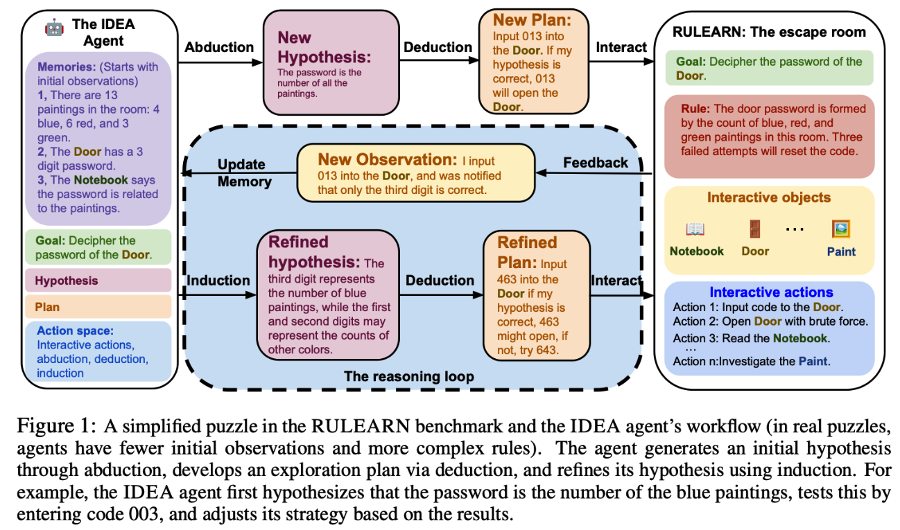

# RULEARN-IDEA
This is the official repository for "[IDEA: Enhancing the Rule Learning Ability of Large Language Model Agent through Induction, Deduction, and Abduction]([https://arxiv.org/abs/2310.01405](https://arxiv.org/abs/2408.10455)" by Kaiyu He, Mian Zhang, Shuo Yan, Peilin Wu, and Zhiyu Chen.



## Introduction
We introduce RULEARN, a novel benchmark specifically designed to assess the rule-learning abilities of LLM agents in interactive settings. In RULEARN, agents strategically interact with simulated environments to gather observations, discern patterns, and solve complex problems. To enhance the rule-learning capabilities for LLM agents, we propose IDEA, a novel reasoning framework that integrates the process of **I**nduction, **DE**duction, and **A**bduction. The IDEA agent generates initial hypotheses from limited observations through abduction, devises plans to validate these hypotheses or leverages them to solve problems via deduction, and refines previous hypotheses using patterns identified from new observations through induction, dynamically establishing and applying rules that mimic human rule-learning behaviors. Our evaluation of the IDEA framework, which involves five representative LLMs, demonstrates significant improvements over the baseline.

## Installation

```bash
git clone https://github.com/MeanStudent/RULEARN_IDEA_project.git
cd RULEARN_IDEA_project
pip install -r requirements.txt
```

## Quickstart

An introductory example is provided in `example_notebook.ipynb`. Feel free to run a single puzzle with selected models to explore the RULEARN environment in action.

You can also run the following code to solve the puzzle yourself. This is the same code we used with human participants in our study.

```bash
python RULEARN_IDEA/human_test.py
```

## Reproduction

The code runs a batch of puzzles in parallel. To reproduce the results, please specify the model name, your OpenAI token, and any other necessary parameters in RULEARN_IDEA/run_experiments.py. Use the following code to run the experiment:
```bash
python RULEARN_IDEA/run_experiments.py
```

## Create your own object and puzzles

#### Interactive objects
Some predefined objects are listed in data/CHIBI_database.xlsx. To add a new object with a unique name or description, you can simply add a new row in this database file. For objects that only require a basic message flow (e.g., performing a certain action triggers a specific message), modifying only the data/CHIBI_database.xlsx file is sufficient.
However, for more complex objects (such as the reactor used in our study) that involve system-level variable changes, you’ll need to create a new subclass inheriting from Fixed_Interact_Pipeline_Object_Base in `fixed_interactive_pipeline_objects.py`. This setup allows you to work with system-level variables to design an object that can change the environment or trigger special effects, with the flexibility to add custom variables for more advanced effects.
For example, consider a simple "Thing creator" object defined as follows: when the agent activates its interactive action, this object will generate a new item and add it to the agent's inventory. For example, a coffee machine that can produce coffee whenever an agent turns it on.
```python
class Fixed_pipeline_Thing_Creator(Fixed_Interact_Pipeline_Object_Base):
    def show(self):
        print(self.Keyword)
        print(self.Information)
        print(self.Parse_pipeline_dict)
        
    def get_information(self, viewer:Optional[Union[str,'CHIBI.CHIBI_Base']] = None):
        return super().get_information(viewer)
        
    def get_keyword(self):
        return f'<{self.Keyword}>'

    def destory(self):
        if self.Belongs_to is not None:
            self.Belongs_to.object_delete(self)

    def edit(self):
        assert False, f'''Information of {type(self)} can only be edited via predefined pipeline'''

    # Fixed object pipeline interfaces
    def decide_input(self, attemptation_action:'plan_system.Attemptation_Interactive_Action', memory_use:Optional[int] = None, memory_retrieve_type = 'Most_recent')->str:  # add a format for GPT to follow the format of generated input
        return super().decide_input(attemptation_action, memory_use = memory_use) # Regular Fixed pipeline thing will only need to dec

        
    def systemic_parse(self, attemptation_action:'plan_system.Attemptation_Interactive_Action', memory_use:Optional[int] = None):
        # define systemic level change here!
        super().systemic_parse(attemptation_action, memory_use = memory_use)
        if attemptation_action.Selected_action_interactive_pipeline['Systemic_parse_id'] == 'get item':
            # currently only create first item
            object_keyword = attemptation_action.Selected_action_interactive_pipeline['Linked_objects'][0]
            new_object = Fixed_Block_helper.create_fixed_object_with_database({'Object_id':0,
                                                                               'Keyword':object_keyword,
                                                                               'Information':f'''One unit of material "{object_keyword}"'''})
            attemptation_action.Host_CHIBI.Profile.Items.object_add(new_object)
            

    def return_action_information_construct(self, attemptation_action:'plan_system.Attemptation_Interactive_Action'):
        return super().return_action_information_construct(attemptation_action)
```

#### State machine objects (Can also be interactive by agents)
The RULEARN framework also supports state machine objects, including simple NPCs or other entities that automatically interact with or influence the environment under specific conditions. You can define these state machine objects by creating a subclass of StateMachineObjectsBase in fixed_interactive_pipeline_objects.py.
For example, here’s how to define a state machine object for an animal that automatically seeks and consumes a specified item from data/CHIBI_database.xlsx. In this database, a sheep is defined as a state machine object that will eat cabbage whenever no agent named "SAM" is in the same space.

```python
class StateMachineObjectAnimal(StateMachineObjectsBase):
    """
    A state machine object that mimics animal behavior; when no agent is in the same space,
    it will seek out and consume a target object. You can add more template actions and 
    interactive actions for agents, such as patting or riding the animal.
    """

    # CHIBI Object Interfaces ---------------------------------------------------
    def show(self):
        print(self.Keyword)
        print(self.Information)
        print(self.Parse_pipeline_dict)
        print(self.State_machine_actions)

    def destroy(self):
        pass  # Additional inherited functions as needed

    def systemic_parse_state_machine(self, state_machine_action_information: Dict[str, Any]):
        """
        This function enables effects when specified conditions in the database are met.
        For example, if the 'Systemic_parse_id' is 'eat', the animal will locate and
        consume the target object.
        """
        if state_machine_action_information['Systemic_parse_id'] == 'eat':
            linked_objects = self.find_linked_object_state_machine(state_machine_action_information)
            object_to_be_eaten = list(linked_objects.values())[0]  # Only one target object for the "eat" action
            object_to_be_eaten.destroy()
            raise utils.TaskCompletedException(f'Mission failed: {self.get_keyword()} ate {object_to_be_eaten.get_keyword()}')

    def systemic_parse(self, ...):
        """
        Defines additional interactive actions for agents, inheriting from the base class.
        For example, this animal can be patted or ridden by an agent.
        """
        pass
```
#### Environment setup
To set up a new interactive environment, follow the dictionary structure in `all_puzzle_settings.py`. Define the space names, edges, and populate it with objects you’ve defined.
## Citation
If you find this useful in your research, please consider citing:

```
@misc{he2024ideaenhancingrulelearning,
      title={IDEA: Enhancing the Rule Learning Ability of Large Language Model Agent through Induction, Deduction, and Abduction}, 
      author={Kaiyu He and Mian Zhang and Shuo Yan and Peilin Wu and Zhiyu Zoey Chen},
      year={2024},
      eprint={2408.10455},
      archivePrefix={arXiv},
      primaryClass={cs.AI},
      url={https://arxiv.org/abs/2408.10455}, 
}
```

